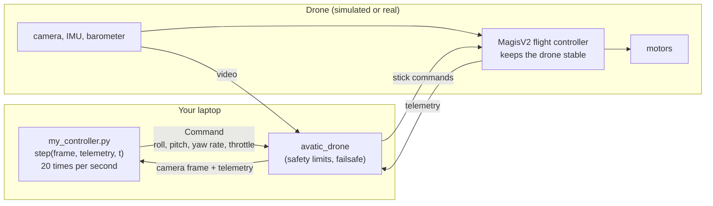
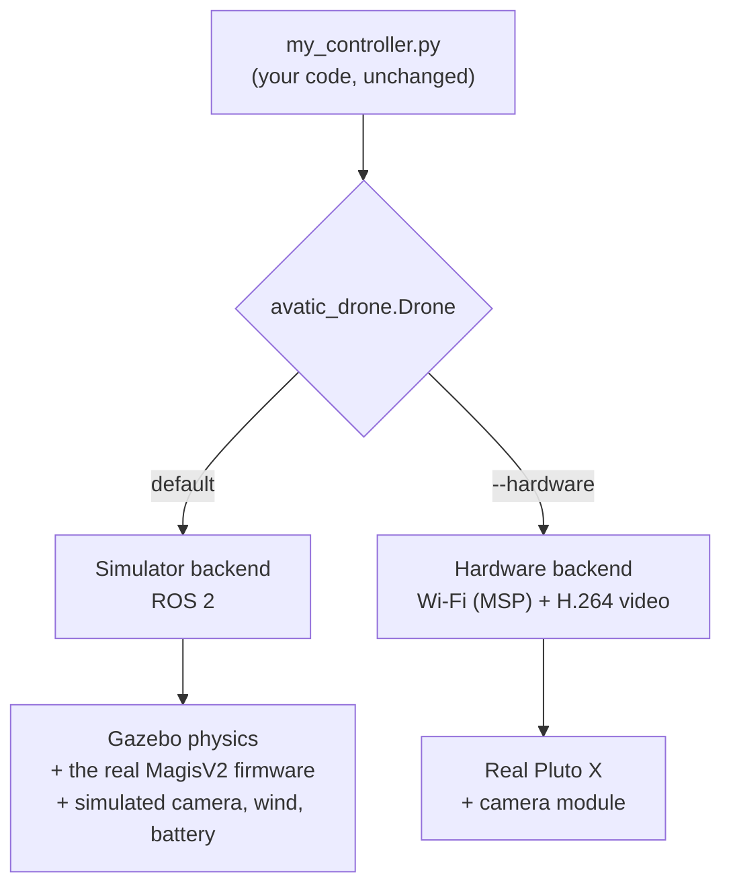

# AVATIC: Autonomous Vision-Based Aerial Target Interception Challenge

This repository is the official software for the **AVATIC competition at
INFINIUM '26**. It has everything a team needs to take part: a simulator of
the Pluto X drone, a ready-to-fill controller template, and tools to test
and score your algorithm.

## The competition

**The goal:** write a program that flies a **Pluto X** drone into balloons
using **only the drone's camera**. Your program runs on **your laptop**. It
receives the video from the drone, decides how to fly, and sends flight
commands back to the drone. Pop as many good balloons as you can in
**15 seconds**, and avoid the red ones.

| Balloon | green | blue | yellow | red |
|---|---|---|---|---|
| Points | **+100** | **+50** | **+25** | **−75** (avoid) |

There are 8 balloons (2 of each colour), so the best possible score is
**350**.

The competition has **two rounds**:

1. **Simulation round.** Your algorithm flies the simulated Pluto X in
   **Gazebo**, on balloon layouts you have not seen before. This is where
   every team starts.
2. **Hardware round.** The top-performing teams from the simulation round
   are shortlisted and fly the **real Pluto X** in a real arena, with the
   same code.

<p align="center">
  
  
</p>
<p align="center"><i>Left: the real Pluto X. Right: the simulated arena in Gazebo.</i></p>

## What this repository gives you

This repository is both the **simulation stack** and a **testbed** for your
algorithm. The simulator runs the drone's real flight-controller software
(the MagisV2 firmware), so what works here should carry over to the real
drone.

<p align="center">
  
</p>
<p align="center"><i>RViz during a run: the drone's camera (top left), its flight path, and the score.</i></p>

### The drone: Pluto X

| | |
|---|---|
| Maker | Drona Aviation |
| Size | 16 × 16 × 4 cm (with propeller guards), 10 × 10 cm frame |
| Weight | about 60 g, **68 g with the camera module** |
| Motors | 4 brushed coreless motors, 55 mm propellers, X layout |
| Battery | 1S LiPo, 3.7 V, 600 mAh (about 9 minutes of flight) |
| Flight controller | STM32F303 (72 MHz) running **MagisV2** firmware |
| Sensors | ICM-20948 (gyroscope, accelerometer, magnetometer), ICP-10111 barometer |
| Link to your laptop | Wi-Fi (MSP protocol) |
| What your program can read | tilt, heading, barometric height, battery, armed state |
| What your program can send | roll, pitch, yaw rate, throttle (like the sticks of a remote control) |

### The camera: Pluto Wi-Fi camera module

| | |
|---|---|
| Resolution | 1280 × 720 (720p, 1 MP) |
| Frame rate | about 18 frames per second over Wi-Fi |
| Field of view | about 80° wide, 50° high (estimate: not published) |
| Mounting | under the nose, looking straight ahead; it tilts with the drone |
| Weight | 8 g |
| Range | about 30 m |
| Delay on the real drone | an estimated 0.15–0.4 s |

In the simulator the camera gives the same 1280 × 720 picture at about
18 frames per second, without the Wi-Fi delay.

### Project structure

```text
AVATIC/
├── outerloop_controller/    ← YOUR CODE
│   ├── my_controller.py        your controller (start here)
│   ├── examples/hello_drone.py example: take off, turn, look at the camera
│   └── avatic_drone/           the drone interface (do not change)
├── analysis/                look at one flight (every run is saved here)
├── evaluation/              test your controller on many new layouts
├── docs/participants/       the step-by-step participant guide
├── demo/                    a demo: a pre-planned route that pops all balloons
├── hitl/                    the connection to the real drone (organisers)
├── simulation_engine/       the simulator (do not change)
├── firmware/magisv2/        the drone's real firmware (do not change)
├── images/                  pictures used in this README
└── .devcontainer/           the Docker development environment
```

You only ever write code in `outerloop_controller/`.

### How your controller flies the drone

The drone has two control loops:

- **The inner loop** is the flight controller on the drone (MagisV2). It
  keeps the drone stable and holds the tilt and turn rate you ask for,
  hundreds of times per second.
- **The outer loop is your program.** 20 times per second it looks at the
  camera picture and the drone's readings, and decides where to go.



### From simulation to the real drone (sim2real)

The same `my_controller.py` flies both. Only the connection underneath
changes:



- **Round 1:** the launch command below (or
  `python3 outerloop_controller/my_controller.py`) flies the simulated drone.
- **Round 2:** `python3 outerloop_controller/my_controller.py --hardware`
  flies the real drone over Wi-Fi.

The simulator includes wind, battery drain, sensor noise and the real
firmware, so a controller that works reliably in simulation has a good
chance on hardware. The main differences on the real drone are the video
delay and the lighting.

## Setup and installation

First clone the repository (with `--recursive`):

```bash
git clone --recursive https://github.com/Srindot/AVATIC.git
cd AVATIC
```

Then choose **one** of the two ways to set it up:

| | Option 1: local setup | Option 2: Docker dev container (recommended) |
|---|---|---|
| Works on | Ubuntu 22.04 only: native, in WSL2 on Windows, or in an Ubuntu 22.04 Docker container you run yourself | Linux, Windows (WSL2) and macOS |
| Difficulty | **harder**: you install ROS 2 and Gazebo yourself | easier: everything is installed for you |
| Best for | people already on Ubuntu 22.04 with ROS | everyone else, **and all Mac users** |

- **Windows:** install [WSL2 with Ubuntu 22.04](https://learn.microsoft.com/en-us/windows/wsl/install)
  (`wsl --install -d Ubuntu-22.04`), then follow either option inside it.
- **macOS:** install [Docker Desktop](https://www.docker.com/products/docker-desktop/)
  and use Option 2.

### Option 1: local setup (Ubuntu 22.04)

> This is the harder way. If something goes wrong, Option 2 is usually
> faster.

1. **Install ROS 2 Humble** by following the official guide:
   <https://docs.ros.org/en/humble/Installation/Alternatives/Ubuntu-Development-Setup.html>

2. **Install Gazebo Harmonic** (with its ROS 2 connection) by following:
   <https://gazebosim.org/docs/latest/ros_installation/>
   (choose ROS 2 Humble + Gazebo Harmonic: `ros-humble-ros-gzharmonic`).

3. **Install the remaining tools:**

   ```bash
   sudo apt install ros-humble-xacro ros-humble-rviz2 python3-colcon-common-extensions \
       libeigen3-dev libyaml-cpp-dev patch ffmpeg \
       python3-numpy python3-yaml python3-matplotlib python3-pytest python3-pip
   pip install notebook
   ```

4. **Build the simulator** (once, from the `AVATIC` folder, a few minutes):

   ```bash
   source /opt/ros/humble/setup.bash
   colcon build
   ```

5. **Load the environment** (in every new terminal, from the `AVATIC` folder):

   ```bash
   source /opt/ros/humble/setup.bash && source install/setup.bash
   ```

6. **Check it works:** run the example controller (see [Using the
   simulator](#using-the-simulator)):

   ```bash
   ros2 launch pluto_x_bringup competition.launch.py controller:=outerloop_controller/examples/hello_drone.py
   ```

Then open `outerloop_controller/my_controller.py` and start writing your
outer loop.

### Option 2: Docker dev container

The dev container is a ready-made Ubuntu 22.04 with ROS 2, Gazebo and
everything else installed. VS Code opens this folder inside it.

1. **Install:**
   - [Docker](https://docs.docker.com/get-docker/) (Docker Desktop on Windows and macOS)
   - [VS Code](https://code.visualstudio.com/) with the
     **Dev Containers** extension (`ms-vscode-remote.remote-containers`)

2. **Allow windows from the container** (so Gazebo and RViz can open):

   - **Ubuntu:**
     ```bash
     sudo apt update && sudo apt install x11-xserver-utils
     ```
   - **Arch:**
     ```bash
     sudo pacman -S xorg-xhost
     ```
   - **Windows (WSL2):** inside your WSL Ubuntu terminal run
     `sudo apt update && sudo apt install x11-xserver-utils`. Keep the
     repository inside WSL (for example `~/AVATIC`) and open it from there
     with `code .`. WSLg then shows the Gazebo and RViz windows.
   - **macOS:** install [XQuartz](https://www.xquartz.org/). In its
     settings under *Security*, tick *Allow connections from network
     clients*, restart it, then run `xhost +localhost` in a terminal.

3. **NVIDIA graphics card (Linux, optional):** the normal **Linux**
   container works on any computer (Gazebo draws with your usual graphics
   driver). To use an NVIDIA card instead, you need its driver working
   (`nvidia-smi` prints your card) and the NVIDIA Container Toolkit:

   ```bash
   curl -fsSL https://nvidia.github.io/libnvidia-container/gpgkey | sudo gpg --dearmor -o /usr/share/keyrings/nvidia-container-toolkit-keyring.gpg \
     && curl -s -L https://nvidia.github.io/libnvidia-container/stable/deb/nvidia-container-toolkit.list | \
       sed 's#deb https://#deb [signed-by=/usr/share/keyrings/nvidia-container-toolkit-keyring.gpg] https://#g' | \
       sudo tee /etc/apt/sources.list.d/nvidia-container-toolkit.list
   sudo apt-get update && sudo apt-get install -y nvidia-container-toolkit
   sudo systemctl restart docker
   ```

   Then choose **Linux + NVIDIA GPU** in the next step. (If the container
   fails with `libnvidia-ml.so.1: cannot open shared object file`, the
   NVIDIA driver is missing: choose plain **Linux**, or install the driver
   with `sudo ubuntu-drivers install` and reboot.) On Windows nothing is
   needed: WSL uses your graphics card automatically.

4. **Open the container:** open the `AVATIC` folder in VS Code, press
   **Ctrl + Shift + P** (Cmd + Shift + P on Mac) and choose
   **Dev Containers: Reopen in Container**:

   

   Pick your platform: **Linux**, **Linux + NVIDIA GPU**, **WSL** or
   **MacOS**. The first time,
   it downloads the image and builds the simulator, which takes a while.
   The next times it opens in seconds.

5. **Open a terminal** in VS Code (*Terminal → New Terminal*, choose
   `bash`). The environment is already loaded, and you are in the
   repository folder.

To start fresh (for example after the organisers update the container),
press Ctrl + Shift + P and choose **Dev Containers: Rebuild Container**.

## Using the simulator

### Load the environment

In **every new terminal** (not needed in the dev container: it does this
for you), from the `AVATIC` folder:

```bash
source /opt/ros/humble/setup.bash     # ROS 2
source install/setup.bash             # this workspace (the simulator)
```

If you see `Package '...' not found`, run these two lines again.

### 1. Watch the demo

```bash
ros2 launch pluto_x_demo balloon_demo.launch.py
```

The drone flies a pre-planned route and pops all six good balloons (score
350). It knows where the balloons are, which your controller does not; it
only shows you what the arena looks like.

### 2. Run the example controller

```bash
ros2 launch pluto_x_bringup competition.launch.py controller:=outerloop_controller/examples/hello_drone.py
```

It takes off, turns slowly and prints how many pixels of each balloon
colour the camera sees. It shows how to use the camera and the commands.

### 3. Run your controller

Write your algorithm in `outerloop_controller/my_controller.py` (the
`step()` method), then:

```bash
ros2 launch pluto_x_bringup competition.launch.py controller:=outerloop_controller/my_controller.py
```

What happens: Gazebo and RViz open, your controller arms the drone after
about 4 s, and **the 15 s start**. When the time is up, the simulation
pauses and the score is printed. Press **Ctrl-C** to stop. (The
`process has died ... exit code -2` lines after Ctrl-C are normal.)
**One run per launch:** start the command again for the next run.

**Launch options** (add them to the end of the command as `name:=value`):

| Option | What it does | Default |
|---|---|---|
| `controller:=<file>` | the controller to run | none (then run it yourself in a second terminal) |
| `headless:=true` | no Gazebo window (faster) | `false` |
| `rviz:=false` | no RViz window | `true` |
| `arena_seed:=random` | a new random balloon layout for this run | `analysis`: the fixed layout in `analysis/seed.yaml` |
| `arena_seed:=7` | a specific layout (any number) | |
| `time_limit_s:=30` | a longer run while developing (judging uses 15) | `15` |
| `record:=false` | do not save this run | `true` |

For example, a fast run without windows on a random layout:

```bash
ros2 launch pluto_x_bringup competition.launch.py controller:=outerloop_controller/my_controller.py headless:=true rviz:=false arena_seed:=random
```

### 4. Look at your flight: the analysis notebook

Every run is saved automatically in `analysis/runs/<date>_<time>/`. Open
the notebook:

```bash
jupyter notebook analysis/analysis.ipynb
```

Choose *Kernel → Restart & Run All*. It shows your latest run: the score
first, then a map of your flight over the balloons, your commands, and what
the camera saw at key moments. See [analysis/README.md](analysis/README.md).

### 5. Test on many layouts: the evaluation

When your controller works on one layout, test it on layouts it has never
seen, the way it will be judged:

```bash
python3 evaluation/evaluate.py --controller outerloop_controller/my_controller.py --runs 10
```

It flies 10 runs on 10 random layouts (about 25 s each, no windows) and
prints your average score. Then open the report:

```bash
jupyter notebook evaluation/evaluation.ipynb
```

See [evaluation/README.md](evaluation/README.md).

### Where to learn more

The **[participant guide](docs/participants/README.md)** explains
everything step by step: the rules, every function you can use, the
camera and directions, tips for a first controller, and fixes for common
errors.

## Submission

Your submission must include **all** of the following:

1. **Your code:** `outerloop_controller/my_controller.py` and any files you
   added in `outerloop_controller/`.
2. **The analysis notebook of your best run:** `analysis/analysis.ipynb`,
   **executed** (with all outputs visible) on your best run.
3. **The evaluation notebook:** `evaluation/evaluation.ipynb`,
   **executed** on an evaluation of your final controller (at least 10
   runs).
4. **A video:** a screen recording of your best simulation run, showing
   the Gazebo window from arming to the final score.
5. **A report** explaining your outer-loop idea: how you find the
   balloons in the image, how you decide which one to go for, how you fly
   to it and avoid the red ones, and what you tried that did not work.

To save an executed notebook: run all cells, then *File → Save*. Or from a
terminal:

```bash
jupyter nbconvert --to notebook --execute --inplace analysis/analysis.ipynb
```

The submission format and deadline will be announced by the organisers.

## Questions?

Contact **Srinath Bhamidipati** at
[srinath.bhamidipati@research.iiit.ac.in](mailto:srinath.bhamidipati@research.iiit.ac.in).

---

<details>
<summary><b>For organisers</b></summary>

Checks:

```bash
colcon test && colcon test-result --all
```

```bash
python3 -m pytest hitl/tests
```

```bash
./simulation_engine/scripts/check_arena.sh
```

The other end-to-end checks are in `simulation_engine/scripts/`
(`check_mission.sh`, `check_yaw.sh`, `check_dynamics.sh`,
`validate_legacy_sim.sh`).

Technical documentation:

- [docs/architecture.md](docs/architecture.md): how it fits together, the
  firmware findings (including the open altitude-hold question, finding
  7), verification
- [docs/arena.md](docs/arena.md): balloons, scoring, arena rules, camera,
  the demo
- [docs/pluto_x_parameters.md](docs/pluto_x_parameters.md): vehicle
  parameters, sources and estimates
- [hitl/README.md](hitl/README.md): the hardware backend, the MSP test
  bridge, and the first-flight checklist
- [simulation_engine/README.md](simulation_engine/README.md): the packages
  and launch files
- [.devcontainer/Dockerfile](.devcontainer/Dockerfile): the lean AVATIC
  image

</details>
