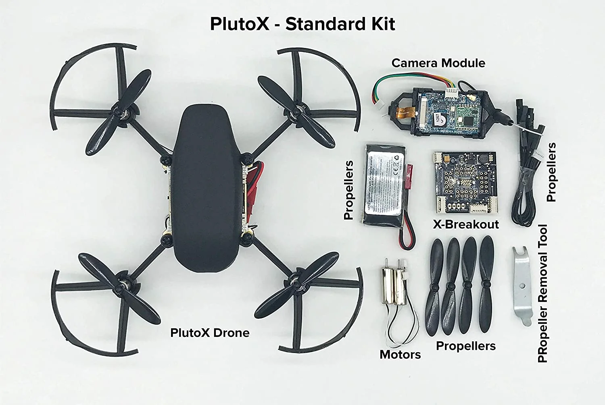
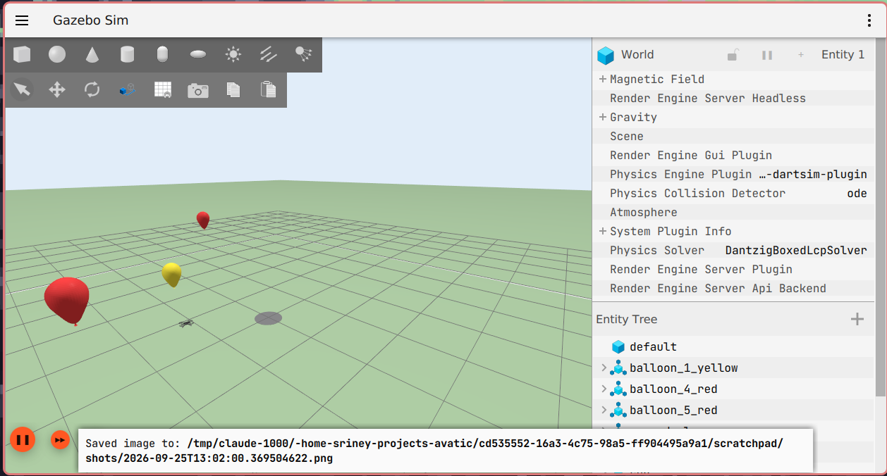
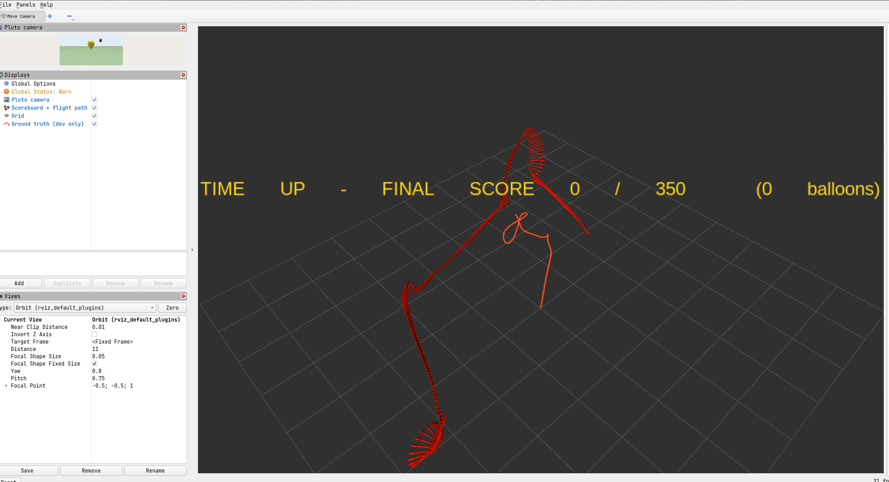
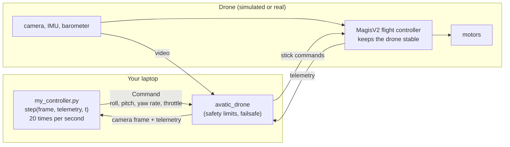
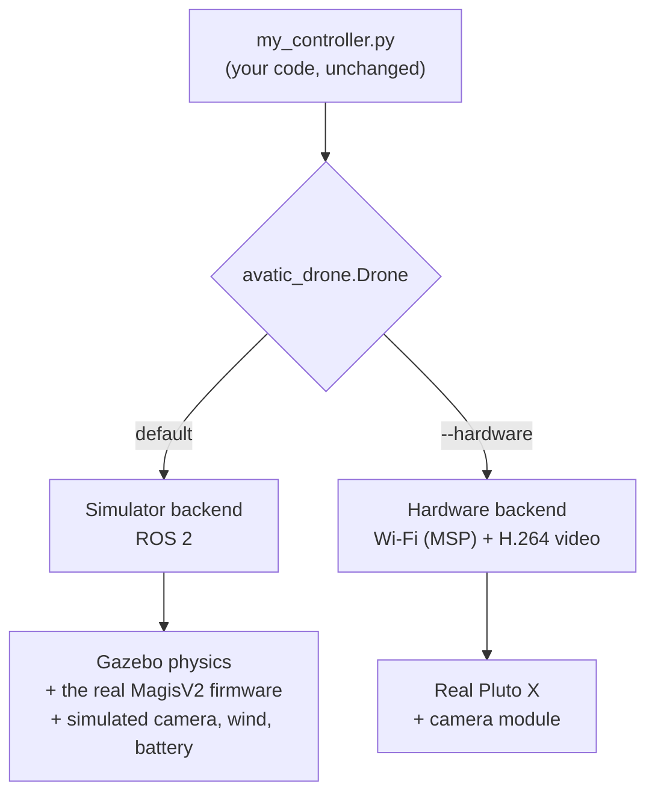
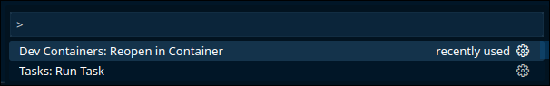

# AVATIC: Autonomous Vision-Based Aerial Target Interception Challenge

This repository is the official software for the **AVATIC competition at
INFINIUM '26**. It has everything a team needs to take part: a simulator of
the Pluto X drone, a ready-to-fill controller template, and tools to test
and score your algorithm.

> **In-depth manual:** step-by-step setup for
> [Ubuntu](workshop/manual/setup_ubuntu.md),
> [Windows](workshop/manual/setup_windows.md) and
> [macOS](workshop/manual/setup_macos.md), and how to use everything
> (every command and option): **[workshop/manual.md](workshop/manual.md)**.
> The workshop slides are in [workshop/presentation.pdf](workshop/presentation.pdf).
> What to submit: **[DELIVERABLES.md](DELIVERABLES.md)**.

## The competition

| | |
|---|---|
| **Event** | **DRONE ARENA @ Infinium**: code your way through an aerial obstacle course, first in the simulator, then with real drones in the arena |
| **Prizes** | worth **₹20,000** |
| **Team size** | 2–4 members |
| **Register** | [forms.gle/6x25JHhfRKqESipF8](https://forms.gle/6x25JHhfRKqESipF8), by **September 29, 11:59 PM** |
| **September 27, 9:30 PM, H104** | pre-workshop and simulator access |
| **September 30, 11:59 PM** | simulation round submission deadline; then shortlisting |
| **October 3** | final: the shortlisted teams fly real drones in the drone arena |
| **More events** | [felicity.iiit.ac.in/infinium/events](https://felicity.iiit.ac.in/infinium/events) |

**The goal:** write a program that flies a **Pluto X** drone into balloons
using **only the drone's camera**. Your program runs on **your laptop**. It
receives the video from the drone, decides how to fly, and sends flight
commands back to the drone. Pop as many good balloons as you can in
**25 seconds**, and avoid the red ones.

| Balloon | green | blue | yellow | red |
|---|---|---|---|---|
| Points | **+100** | **+50** | **+25** | **−75** (avoid) |

There are **18 balloons**: 3 green, 5 blue, 6 yellow and 4 red (the
high-value ones are the rarest), so the best possible score is **700**.
Where each balloon floats, and which one has which colour, changes with
every layout. There are more good balloons than anyone can pop in 25 s,
so you never run out.

The competition has **two rounds**:

1. **Simulation round.** Your algorithm flies the simulated Pluto X in
   **Gazebo**, on balloon layouts you have not seen before. This is where
   every team starts.
2. **Hardware round.** The top-performing teams from the simulation round
   are shortlisted and fly the **real Pluto X** in a real arena, with the
   same code.

> **What you submit for the simulation round: [DELIVERABLES.md](DELIVERABLES.md).**
> Your controller code, your best run and an evaluation (with both notebooks
> executed), a **video** of your best run popping balloons and avoiding the
> red ones, and a **technical report** (approach, results, analysis, failure
> cases). Everything goes in [`output/`](output/README.md); one command,
> `python3 output/collect.py`, collects most of it. Your controller may use
> only the camera and the flight controller's readings: see
> [fair play](docs/participants/2_the_challenge.md#fair-play).

<p align="center">
  
  
</p>
<p align="center"><i>Left: the real Pluto X. Right: the simulated arena in Gazebo.</i></p>

## What this repository gives you

This repository is both the **simulation stack** and a **testbed** for your
algorithm. The simulator runs the drone's real flight-controller software
(the MagisV2 firmware), so what works here should carry over to the real
drone.

<p align="center">
  
</p>
<p align="center"><i>RViz during a run: the drone's camera (top left), its flight path, and the score.</i></p>

### The drone: Pluto X

| | |
|---|---|
| Maker | Drona Aviation |
| Size | 16 × 16 × 4 cm (with propeller guards), 10 × 10 cm frame |
| Weight | about 60 g, **68 g with the camera module** |
| Motors | 4 brushed coreless motors, 55 mm propellers, X layout |
| Battery | 1S LiPo, 3.7 V, 600 mAh (about 9 minutes of flight) |
| Flight controller | STM32F303 (72 MHz) running **MagisV2** firmware |
| Sensors | ICM-20948 (gyroscope, accelerometer, magnetometer), ICP-10111 barometer |
| Link to your laptop | Wi-Fi (MSP protocol) |
| What your program can read | tilt, heading, barometric height, battery, armed state |
| What your program can send | roll, pitch, yaw rate, throttle (like the sticks of a remote control) |

### The camera: Pluto Wi-Fi camera module

| | |
|---|---|
| Resolution | 1280 × 720 (720p, 1 MP) |
| Frame rate | about 18 frames per second over Wi-Fi |
| Field of view | about 80° wide, 50° high (estimate: not published) |
| Mounting | under the nose, looking straight ahead; it tilts with the drone |
| Weight | 8 g |
| Range | about 30 m |
| Delay on the real drone | an estimated 0.15–0.4 s |

In the simulator the camera gives the same 1280 × 720 picture at about
18 frames per second, without the Wi-Fi delay.

#### Camera intrinsics (simulated camera)

An ideal pinhole camera: square pixels and no lens distortion.

| Parameter | Value |
|---|---|
| Image size | 1280 × 720 px, RGB |
| Horizontal field of view | 80° (vertical: about 50.5°) |
| Focal length fx = fy | 762.7 px (= 640 / tan 40°) |
| Principal point (cx, cy) | (640, 360), the image centre |
| Distortion | none |
| Image noise | Gaussian, standard deviation 0.7 % of full scale (about 2 levels out of 255) |
| Frame rate | about 18 Hz |

```text
      [ 762.7    0    640 ]
K  =  [   0    762.7  360 ]
      [   0      0      1 ]
```

A point (X, Y, Z) in front of the camera (camera frame: X right, Y down,
Z forward, in metres) appears at pixel u = 762.7 X / Z + 640,
v = 762.7 Y / Z + 360.

#### Camera extrinsics (camera on the drone)

Measured from the drone's centre (its centre of mass), in the drone's own
frame: x forward, y left, z up.

| Parameter | Value |
|---|---|
| Position | x = +0.035 m (forward), y = 0, z = −0.018 m (below the centre) |
| Orientation | looks straight ahead along the drone's x axis, no tilt |

From the camera's frame (X right, Y down, Z forward) to the drone's frame:

```text
                [  0   0   1 ]                    [  0.035 ]
R_drone_cam  =  [ -1   0   0 ]      t_drone_cam =  [  0     ]  m
                [  0  -1   0 ]                    [ -0.018 ]
```

so a point p in the camera frame is at `R_drone_cam @ p + t_drone_cam` in
the drone frame. The camera is rigidly fixed: when the drone tilts, the
camera tilts with it.

These are the simulator's values. The real camera module's lens and exact
mounting are not published: the field of view and the position are
estimates, to be measured on the real drone.

### The simulated sensors

The simulator gives the drone's real flight-controller firmware the same
sensor data as the real chips, with realistic noise. The firmware
calibrates them and estimates the tilt, heading and height itself, as on
the real drone. **Your controller only gets these estimates, never perfect
values.**

| Sensor | Real chip | Simulated |
|---|---|---|
| Gyroscope | ICM-20948 | ±2000 °/s, noise 0.1 °/s, startup bias about 1 °/s (removed by the firmware's calibration) |
| Accelerometer | ICM-20948 | ±8 g, noise 1 mg, residual bias 5 mg |
| Magnetometer | AK09916 (in the ICM-20948) | Earth's field at Hyderabad (40 µT north, 19.5 µT down), compass calibrated |
| Barometer | ICP-10111 | pressure at 505 m altitude and 30 °C, noise 1 Pa (about 9 cm of height) |
| Battery monitor | on the board | 1S 600 mAh LiPo: voltage 4.2 V full, sags under load; thrust drops as the battery drains |
| Camera | Pluto Wi-Fi camera | see above |

The simulator also adds **wind gusts**, a **50 ms command delay** (like
the Wi-Fi link), motor lag, and air drag. Not modelled: motor vibration,
magnetic disturbances, Wi-Fi packet loss, and the real camera's video
delay. All values are in
[`simulation_engine/pluto_x_core/config/pluto_x_estimated.yaml`](simulation_engine/pluto_x_core/config/pluto_x_estimated.yaml),
with their sources in [docs/pluto_x_parameters.md](docs/pluto_x_parameters.md).

### Project structure

```text
AVATIC/
├── outerloop_controller/    ← YOUR CODE
│   ├── my_controller.py        your controller (start here)
│   ├── examples/hello_drone.py example: take off, turn, look at the camera
│   └── avatic_drone/           the drone interface (do not change)
├── analysis/                look at one flight (every run is saved here)
├── evaluation/              test your controller on many new layouts, and the
│                            fair-play code check (check_controller.py)
├── output/                  your submission goes here (collect.py fills it)
├── DELIVERABLES.md          what to submit
├── docs/participants/       the step-by-step participant guide
├── workshop/                the manual (setup, usage) and the workshop slides
├── demo/                    a demo: a pre-planned route that pops all balloons
├── hitl/                    the connection to the real drone (organisers)
├── simulation_engine/       the simulator (do not change)
├── firmware/magisv2/        the drone's real firmware (do not change)
├── docs/                    technical documents (architecture, arena, parameters)
├── images/                  pictures used in this README
├── .devcontainer/           the Docker development environment
├── resources/               Pluto Python tutorials (reference)
└── literature_survey/       related papers (reading list with links)
```

You only ever write code in `outerloop_controller/`.

### How your controller flies the drone

The drone has two control loops:

- **The inner loop** is the flight controller on the drone (MagisV2). It
  keeps the drone stable and holds the tilt and turn rate you ask for,
  hundreds of times per second.
- **The outer loop is your program.** 20 times per second it looks at the
  camera picture and the drone's readings, and decides where to go.



What goes in and out of your `step(frame, telemetry, t)`:

| | what | format |
|---|---|---|
| **you send** | `Command(roll, pitch, yaw_rate, throttle)` | four numbers, no units: `roll`, `pitch` −1 … 1 are **tilt angles** the flight controller holds (0.2 ≈ 7°, max 20°), `yaw_rate` −1 … 1 a **turn rate** (≈ 77°/s per unit), `throttle` 0 … 1 the **total thrust** (≈ 0.76 hovers; no altitude hold) |
| **it becomes** | 8 RC channels, 50 per second | µs, 1000 … 2000: roll, pitch, yaw = 1500 + 500 × value, throttle = 1000 + 1000 × value; angle mode on, altitude hold off; the same in the simulator and over Wi-Fi (MSP) on the real drone |
| **you get** | `telemetry` (`Telemetry`) | the flight controller's estimates: `roll_deg`, `pitch_deg` (+ = nose up), `heading_deg` (clockwise from north), `altitude_m` (barometer), `battery_v`, `armed`, `ready_to_arm`, `time_s`; no position, no speed |
| | `frame` (`Frame`) | `frame.image`: NumPy `uint8` array (720, 1280, 3), **RGB**; `frame.seq`: picture number; about 18 per second |

Every field, its type and unit, and exactly what reaches the flight
controller: [guide page 3](docs/participants/3_writing_your_controller.md#what-reaches-the-flight-controller).

### From simulation to the real drone (sim2real)

The same `my_controller.py` flies both. Only the connection underneath
changes:



- **Round 1:** the launch command below flies the simulated drone (or
  `python3 outerloop_controller/my_controller.py`, with the simulator
  already running in another terminal).
- **Round 2:** `python3 outerloop_controller/my_controller.py --hardware`
  flies the real drone over Wi-Fi.

The simulator includes wind, battery drain, sensor noise and the real
firmware, so a controller that works reliably in simulation has a good
chance on hardware. The main differences on the real drone are the video
delay and the lighting.

## Setup and installation

> **Step-by-step for your computer:** [workshop/manual.md](workshop/manual.md) has a separate,
> detailed page for [Ubuntu](workshop/manual/setup_ubuntu.md),
> [Windows](workshop/manual/setup_windows.md) and [macOS](workshop/manual/setup_macos.md), and
> a [usage page](workshop/manual/usage.md) with every command and option. The
> summary below covers the same steps.

First clone the repository (with `--recursive`):

```bash
git clone --recursive https://github.com/Srindot/AVATIC.git
cd AVATIC
```

Then choose **one** of the two ways to set it up:

| | Option 1: local setup | Option 2: Docker dev container (recommended) |
|---|---|---|
| Works on | Ubuntu 22.04 only: native, in WSL2 on Windows, or in an Ubuntu 22.04 Docker container you run yourself | Linux, Windows (WSL2) and macOS |
| Difficulty | **harder**: you install ROS 2 and Gazebo yourself | easier: everything is installed for you |
| Best for | people already on Ubuntu 22.04 with ROS | everyone else, **and all Mac users** |

- **Windows:** install [WSL2 with Ubuntu 22.04](https://learn.microsoft.com/en-us/windows/wsl/install)
  (`wsl --install -d Ubuntu-22.04`), then follow either option inside it.
- **macOS:** install [Docker Desktop](https://www.docker.com/products/docker-desktop/)
  and use Option 2.

### Option 1: local setup (Ubuntu 22.04)

> This is the harder way. If something goes wrong, Option 2 is usually
> faster.

1. **Install ROS 2 Humble** from the Debian packages, following the
   official guide (the "desktop" install is fine):
   <https://docs.ros.org/en/humble/Installation/Ubuntu-Install-Debs.html>

   (Use this package install, not the build-from-source guide: the next
   steps need the packages in `/opt/ros/humble`.)

2. **Install Gazebo Harmonic** and its ROS 2 connection. Add the Gazebo
   (OSRF) package source as described in
   <https://gazebosim.org/docs/harmonic/install_ubuntu/>, then:

   ```bash
   sudo apt install gz-harmonic ros-humble-ros-gzharmonic
   ```

   (More about the ROS 2 connection: <https://gazebosim.org/docs/harmonic/ros_installation/>.)

3. **Install the remaining tools:**

   ```bash
   sudo apt install build-essential cmake pkg-config patch \
       ros-humble-xacro ros-humble-rviz2 ros-humble-ament-cmake-gtest python3-colcon-common-extensions \
       libeigen3-dev libyaml-cpp-dev ffmpeg \
       python3-numpy python3-yaml python3-matplotlib python3-pytest python3-pip python3-opencv
   pip install notebook
   ```

   (Use Ubuntu's `python3-opencv`, not `pip install opencv-python`: the pip
   version installs NumPy 2, which breaks ROS and matplotlib here.)

4. **Build the simulator** (once, from the `AVATIC` folder, a few minutes):

   ```bash
   source /opt/ros/humble/setup.bash
   colcon build
   ```

5. **Load the environment** (in every new terminal, from the `AVATIC` folder):

   ```bash
   source /opt/ros/humble/setup.bash && source install/setup.bash
   ```

6. **Check it works:** run the example controller (see [Using the
   simulator](#using-the-simulator)):

   ```bash
   ros2 launch pluto_x_bringup competition.launch.py controller:=outerloop_controller/examples/hello_drone.py
   ```

Then open `outerloop_controller/my_controller.py` and start writing your
outer loop.

### Option 2: Docker dev container

The dev container is a ready-made Ubuntu 22.04 with ROS 2, Gazebo and
everything else installed. VS Code opens this folder inside it. You only
install the tools below on your own computer.

**Your computer needs:** about **15 GB of free disk** (the image is a
1 GB download and 5 GB on disk, plus the simulator build), **8 GB of
RAM** (16 GB is better), and a good internet connection for the first
start.

#### What to install: Linux (Ubuntu)

| # | What | Why | How |
|---|---|---|---|
| 1 | **Docker Engine** | runs the container | `curl -fsSL https://get.docker.com \| sh` ([other ways](https://docs.docker.com/engine/install/ubuntu/)) |
| 2 | **Docker without sudo** | VS Code runs Docker as you | `sudo usermod -aG docker $USER`, then **log out and in** |
| 3 | **xhost** | lets the container open Gazebo and RViz windows | `sudo apt install x11-xserver-utils` (Arch: `sudo pacman -S xorg-xhost`) |
| 4 | **git** | clone the repository | `sudo apt install git` |
| 5 | **VS Code** + the **Dev Containers** extension | opens the folder in the container | [VS Code](https://code.visualstudio.com/), then extension `ms-vscode-remote.remote-containers` |
| 6 | *optional:* **NVIDIA driver + NVIDIA Container Toolkit** | only to let Gazebo use an NVIDIA card | see below |

Check: `docker run --rm hello-world` works **without** `sudo`, and
`xhost` prints something (not "command not found").

**NVIDIA card (optional).** The normal **Linux** container works on any
computer (Gazebo draws with your usual graphics driver). To use an NVIDIA
card instead, the NVIDIA driver must work (`nvidia-smi` prints your card;
if not: `sudo ubuntu-drivers install` and reboot), and you need the NVIDIA
Container Toolkit:

```bash
curl -fsSL https://nvidia.github.io/libnvidia-container/gpgkey | sudo gpg --dearmor -o /usr/share/keyrings/nvidia-container-toolkit-keyring.gpg \
  && curl -s -L https://nvidia.github.io/libnvidia-container/stable/deb/nvidia-container-toolkit.list | \
    sed 's#deb https://#deb [signed-by=/usr/share/keyrings/nvidia-container-toolkit-keyring.gpg] https://#g' | \
    sudo tee /etc/apt/sources.list.d/nvidia-container-toolkit.list
sudo apt-get update && sudo apt-get install -y nvidia-container-toolkit
sudo nvidia-ctk runtime configure --runtime=docker
sudo systemctl restart docker
```

Then choose **Linux + NVIDIA GPU** when opening the container. If it fails
with `libnvidia-ml.so.1: cannot open shared object file`, the NVIDIA driver
is missing: choose plain **Linux** instead.

#### What to install: Windows (WSL2)

| # | What | Why | How |
|---|---|---|---|
| 1 | **WSL2 with Ubuntu 22.04** | Linux inside Windows (WSLg shows Linux windows) | PowerShell as administrator: `wsl --install -d Ubuntu-22.04`, restart, then `wsl --update` |
| 2 | **Docker Desktop** | runs the container | [Docker Desktop](https://www.docker.com/products/docker-desktop/), with the WSL 2 backend (the default) |
| 3 | **Docker's WSL integration** | lets Ubuntu use Docker | Docker Desktop → *Settings → Resources → WSL integration* → turn on **Ubuntu-22.04** |
| 4 | **VS Code** + the **WSL** and **Dev Containers** extensions | opens the folder in WSL, then in the container | [VS Code](https://code.visualstudio.com/), then extensions `ms-vscode-remote.remote-wsl` and `ms-vscode-remote.remote-containers` |
| 5 | **git** and **xhost**, inside Ubuntu | clone the repository; allow container windows | in the Ubuntu terminal: `sudo apt update && sudo apt install git x11-xserver-utils` |

Clone the repository **inside Ubuntu** (run the `git clone` command in the
Ubuntu terminal, for example into `~/AVATIC`), then open it with `code .`
from there. An NVIDIA card needs only its normal Windows driver: nothing
else. Check: in the Ubuntu terminal, `docker run --rm hello-world` works.

#### What to install: macOS

| # | What | Why | How |
|---|---|---|---|
| 1 | **Docker Desktop** | runs the container | [Docker Desktop](https://www.docker.com/products/docker-desktop/) (choose Apple Silicon or Intel) |
| 2 | **Rosetta in Docker** (Apple Silicon only: M1, M2, M3 …) | the AVATIC image is built for Intel/AMD; Rosetta runs it much faster than plain emulation | Docker Desktop → *Settings → General* → turn on **"Use Rosetta for x86_64/amd64 emulation on Apple Silicon"** |
| 3 | **XQuartz** | shows the container's Gazebo and RViz windows (it includes `xhost`) | [XQuartz](https://www.xquartz.org/); in its *Settings → Security* tick **Allow connections from network clients**, then quit and reopen XQuartz |
| 4 | **git** | clone the repository | `xcode-select --install` |
| 5 | **VS Code** + the **Dev Containers** extension | opens the folder in the container | [VS Code](https://code.visualstudio.com/), then extension `ms-vscode-remote.remote-containers` |

Before opening the container, and again after every XQuartz restart, run
in a Mac terminal:

```bash
xhost +localhost
```

In Docker Desktop → *Settings → Resources*, give Docker at least **8 GB of
memory**. On a Mac, Gazebo draws without the GPU, so the windows are
slower than on Linux; runs with `headless:=true rviz:=false` are not
affected.

#### Open the container

1. **Open the `AVATIC` folder in VS Code**, press **Ctrl + Shift + P**
   (Cmd + Shift + P on Mac) and choose **Dev Containers: Reopen in
   Container**:

   

2. **Pick your platform:** **Linux**, **Linux + NVIDIA GPU**, **WSL** or
   **MacOS**. The first time, it downloads the image and builds the
   simulator, which takes a while (watch the log; it ends with
   `== done`). The next times it opens in seconds.

3. **Open a terminal** in VS Code (*Terminal → New Terminal*, choose
   `bash`). The environment is already loaded, and you are in the
   repository folder.

To start fresh (for example after the organisers update the container),
press Ctrl + Shift + P and choose **Dev Containers: Rebuild Container**.

## Using the simulator

### Load the environment

**Dev container:** nothing to do. Every new terminal is ready and starts in
the repository folder. If something says `Package '...' not found`, open a
new terminal.

**Local setup:** in every new terminal, from the `AVATIC` folder:

```bash
source /opt/ros/humble/setup.bash     # ROS 2
source install/setup.bash             # this workspace (the simulator)
```

If you see `Package '...' not found`, run these two lines again.

### 1. Watch the demo

```bash
ros2 launch pluto_x_demo balloon_demo.launch.py
```

The drone flies a pre-planned route and pops all six good balloons of its
own fixed 8-balloon layout (score 350 there). It knows where the balloons are, which your controller does not, and
it is given 35 s on a fixed layout instead of 25 s: it only shows you what
the arena looks like, it is not a benchmark.

### 2. Run the example controller

```bash
ros2 launch pluto_x_bringup competition.launch.py controller:=outerloop_controller/examples/hello_drone.py
```

It takes off, turns slowly and prints how many pixels of each balloon
colour the camera sees. It shows how to use the camera and the commands.

### 3. Run your controller

Write your algorithm in `outerloop_controller/my_controller.py` (the
`step()` method), then:

```bash
ros2 launch pluto_x_bringup competition.launch.py controller:=outerloop_controller/my_controller.py
```

What happens: Gazebo and RViz open, your controller arms the drone after
about 4 s, and **the 25 s clock starts**. When the time is up, the simulation
pauses and the score is printed. Press **Ctrl-C** to stop. (The
`process has died ... exit code -2` lines after Ctrl-C are normal.)
**One run per launch:** start the command again for the next run.

**Launch options** (add them to the end of the command as `name:=value`):

| Option | What it does | Default |
|---|---|---|
| `controller:=<file>` | the controller to run | none (then run it yourself in a second terminal) |
| `headless:=true` | no Gazebo window (faster) | `false` |
| `rviz:=false` | no RViz window | `true` |
| `arena_seed:=random` | a new random balloon layout for this run | `analysis`: the development layout, whose seed is in `analysis/seed.yaml` (42 at first) |
| `arena_seed:=7` | a specific layout (any number) | |
| `time_limit_s:=30` | a longer run while developing (the run is then marked not official) | `25` (the official rules) |
| `record:=false` | do not save this run | `true` |
| `record_dir:=<folder>` | save runs in this folder instead of `analysis/runs/` | `analysis/runs` |

`controller:=` also takes an absolute path, and a controller stored in any
folder can import `avatic_drone` when started this way.

For example, a fast run without windows on a random layout:

```bash
ros2 launch pluto_x_bringup competition.launch.py controller:=outerloop_controller/my_controller.py headless:=true rviz:=false arena_seed:=random
```

### 4. Look at your flight: the analysis notebook

Every run is saved automatically in `analysis/runs/<date>_<time>/`. Open
the notebook:

```bash
jupyter notebook analysis/analysis.ipynb
```

Run all the cells: in VS Code (dev container) open the notebook and click
**Run All**; in the browser, *Run → Run All Cells*. It shows your latest run: the score
first, then a map of your flight over the balloons, your commands, and what
the camera saw at key moments. See [analysis/README.md](analysis/README.md).

### 5. Test on many layouts: the evaluation

When your controller works on one layout, test it on layouts it has never
seen, the way it will be judged:

```bash
python3 evaluation/evaluate.py --controller outerloop_controller/my_controller.py --runs 5
```

It flies 5 runs on 5 random layouts (about 40 s each on a fast computer,
no windows) and prints your average score. Then open the report:

```bash
jupyter notebook evaluation/evaluation.ipynb
```

See [evaluation/README.md](evaluation/README.md).

### Where to learn more

The **[participant guide](docs/participants/README.md)** explains
everything step by step: the rules, every function you can use, the
camera and directions, tips for a first controller, and fixes for common
errors.

## Documentation

**For teams**

| Document | What it covers |
|---|---|
| [DELIVERABLES.md](DELIVERABLES.md) | what to submit, the video and report requirements, `output/collect.py` |
| [workshop/manual.md](workshop/manual.md) | the in-depth manual: setup on [Ubuntu](workshop/manual/setup_ubuntu.md), [Windows](workshop/manual/setup_windows.md) and [macOS](workshop/manual/setup_macos.md), and [usage](workshop/manual/usage.md) (every command and option) |
| [workshop/presentation.pdf](workshop/presentation.pdf) | the workshop slides |
| [Participant guide](docs/participants/README.md) | step by step, seven pages: |
| &nbsp;&nbsp;1. [Getting started](docs/participants/1_getting_started.md) | install, first flight |
| &nbsp;&nbsp;2. [The challenge](docs/participants/2_the_challenge.md) | points, time, layouts, what you may use, [fair play](docs/participants/2_the_challenge.md#fair-play), what you submit |
| &nbsp;&nbsp;3. [Writing your controller](docs/participants/3_writing_your_controller.md) | the template, commands, telemetry, safety limits, height control |
| &nbsp;&nbsp;4. [Camera and directions](docs/participants/4_camera_and_directions.md) | what the camera sees, which way is which, distance from pixels |
| &nbsp;&nbsp;5. [Testing and improving](docs/participants/5_testing_and_improving.md) | the analysis and evaluation notebooks, collecting the submission |
| &nbsp;&nbsp;6. [Tips and troubleshooting](docs/participants/6_tips_and_troubleshooting.md) | how to start, common errors and fixes, glossary |
| &nbsp;&nbsp;7. [The real drone](docs/participants/7_real_drone.md) | the hardware round |
| [outerloop_controller/README.md](outerloop_controller/README.md) | the controller folder and the API at a glance |
| [analysis/README.md](analysis/README.md) | the analysis notebook, the development layout (seed), the recorded files |
| [evaluation/README.md](evaluation/README.md) | the evaluation and its report; the fair-play checks (organisers) |
| [output/README.md](output/README.md) | the submission folder |
| [demo/README.md](demo/README.md) | the demo route |
| [literature_survey/README.md](literature_survey/README.md) | related papers (links) |

**Technical and for organisers**

| Document | What it covers |
|---|---|
| [docs/architecture.md](docs/architecture.md) | how the simulator works (firmware in the loop), the firmware findings |
| [docs/arena.md](docs/arena.md) | the arena: balloons, popping, scoring, the time limit, the rules and why they were chosen |
| [docs/pluto_x_parameters.md](docs/pluto_x_parameters.md) | every vehicle parameter and its source |
| [docs/legacy_port.md](docs/legacy_port.md) | the older (legacy) controller stack, still available as `flight_controller: legacy` |
| [simulation_engine/README.md](simulation_engine/README.md) | the simulator's packages (organisers only) |
| [hitl/README.md](hitl/README.md) | the real-drone backend (MSP over Wi-Fi), its safety features, the first hardware session checklist |

## Submission

Everything goes in the `output/` folder; the full list, the video and
report requirements, and how to collect it all with one command
(`python3 output/collect.py`) are in **[DELIVERABLES.md](DELIVERABLES.md)**.
In short, all **required**:

1. **Your code:** `outerloop_controller/my_controller.py`, plus any Python
   files you add next to it in `outerloop_controller/`. Do not change
   anything in `simulation_engine/`, `outerloop_controller/avatic_drone/`
   or `hitl/`: the judges use their own copies.
2. **Your best run** and its **analysis notebook**, executed.
3. **An evaluation of your final controller** (at least 5 runs) and its
   **notebook**, executed.
4. **A video:** a screen recording of your best run (Gazebo and RViz, from
   arming to the end), showing the pops and how you avoid the red balloons.
5. **A technical report** (PDF, at most 8 pages): your approach
   (perception, decision and red-balloon avoidance, control), results,
   analysis and at least two failure cases.

The deadline is **September 30, 11:59 PM** (where to upload will be announced by the organisers).

## Questions?

Contact **Srinath Bhamidipati** at
[srinath.bhamidipati@research.iiit.ac.in](mailto:srinath.bhamidipati@research.iiit.ac.in).

---

<details>
<summary><b>For organisers</b></summary>

Checks (run before a release and before judging):

```bash
colcon test && colcon test-result --all
```

```bash
python3 -m pytest -q evaluation/tests analysis/tests hitl/tests
```

```bash
./simulation_engine/scripts/check_arena.sh
```

The other end-to-end checks are in `simulation_engine/scripts/`
(`check_mission.sh`, `check_yaw.sh`, `check_dynamics.sh`,
`validate_legacy_sim.sh`).

Judging: evaluate every submission on one computer, over the same list of
seeds the teams have not seen
(`python3 evaluation/evaluate.py --controller <file> --seeds <list>`), and
review the fair-play findings ([evaluation/README.md](evaluation/README.md#fair-play-organisers)).

Technical documents: see [Documentation](#documentation) above.

</details>
